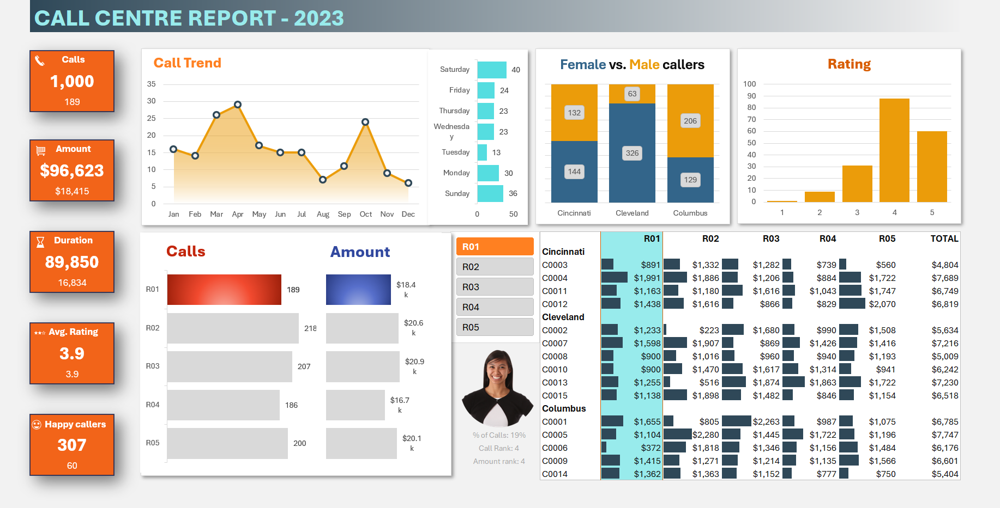

# 📊 Call Centre Performance Dashboard — Excel Portfolio Project

<div align="center">



[](https://www.microsoft.com/en-us/microsoft-365/excel)
[](https://support.microsoft.com/en-us/office/power-pivot-overview)
[](https://learn.microsoft.com/en-us/dax/)
[]()

*A fully interactive, slicer-driven business intelligence dashboard built entirely in Microsoft Excel — analyzing 1,000 call records across 5 representatives and 3 regional markets.*

</div>

---

## 📌 Table of Contents

- [Project Overview](#-project-overview)
- [Features & Capabilities](#-features--capabilities)
- [Data Description](#-data-description)
- [Project Files](#-project-files)
- [Software Requirements](#-software-requirements)
- [Usage Instructions](#-usage-instructions)
- [Dashboard Walkthrough](#-dashboard-walkthrough)
- [Learning Outcomes](#-learning-outcomes)
- [References & Attribution](#-references--attribution)

---

## 🎯 Project Overview

This project is a **replicated and extended Excel business intelligence dashboard** originally designed to demonstrate advanced Excel capabilities in a data analytics portfolio context. It simulates a real-world call centre operations scenario, transforming raw transactional call records and customer demographic data into a dynamic, executive-facing performance report.

The dashboard enables stakeholders to:

- Monitor **overall call centre KPIs** at a glance (volume, revenue, duration, ratings)
- **Drill down by representative** using interactive slicers — instantly filtering all visuals simultaneously
- Identify **regional and demographic trends** across Cincinnati, Cleveland, and Columbus
- Benchmark **individual representative performance** via dynamic ranking and profile panels

This project replicates and closely follows the tutorial published by **Chandoo** on YouTube (see [References](#-references--attribution)), with the objective of building hands-on proficiency across the full Excel BI pipeline — from data modelling through to dashboard delivery.

---

## ⚡ Features & Capabilities

### 🔗 Data Modelling
| Feature | Details |
|---|---|
| **Power Pivot Data Model** | Two structured Excel tables (`Calls` + `Customers`) linked via a `CustomerID` relationship — enabling cross-table pivot analysis without VLOOKUP duplication |
| **DAX Measures** | Custom `CallCount` (COUNTROWS) and `TotalAmount` (SUM) measures with pre-defined number formatting, replacing brittle cell-formula approaches |
| **Multi-Table Pivot Tables** | All dashboard KPIs driven by a single refresh-ready pivot cache across both tables |

### 📐 Advanced Excel Formulas
| Formula | Purpose |
|---|---|
| `XLOOKUP` | Dynamic lookup of representative-level call counts, revenue totals, and portrait images |
| `RANK.AVG` | Real-time ranking of representatives by calls and amount — with multi-select guard logic |
| `TEXT()` | Formatted percentage string construction for the profile summary panel |
| `IF + COUNTA` | Conditional suppression of rank labels and images when multiple reps are selected |
| `CONCATENATE / &` | Dynamic sentence assembly for the representative summary card |

### 📊 Data Visualisations
| Chart Type | Insight Delivered |
|---|---|
| **Line + Area Chart** | Monthly call volume trend (Jan–Dec) — identifies seasonal demand patterns |
| **Horizontal Bar Chart** | Day-of-week call distribution — optimises scheduling across a 7-day operation |
| **Stacked Bar Chart** | Female vs. Male caller split per city — surfaces regional demographic differences |
| **Grouped Bar Chart** | Satisfaction rating frequency distribution (1–5 scale) — tracks service quality |
| **Dual Bar Chart** | Side-by-side representative calls vs. revenue — highlights productivity outliers |
| **Data-Bar Matrix** | Revenue-per-customer by representative and region — conditional formatting heat map |

### 🎛️ Interactivity
- **5-Item Representative Slicer** — single or multi-select; all charts and KPI tiles update in real time
- **Dynamic Profile Panel** — displays representative photo, % of calls, call rank, and revenue rank; auto-hides on multi-select
- **Cell-Linked Portrait Images** — XLOOKUP-driven image binding using Excel's native cell picture feature
- **One-Click Refresh** — `Data → Refresh All` ingests new records appended to the source table, updating every metric and chart instantly

### 🎨 Design & UX
- **Slipstream color theme** applied workbook-wide for consistent palette propagation
- **Aptos Extra Bold / Aptos** font pairing (Microsoft 365 native) for modern, professional typography
- **Dedicated `Pivots` sheet** — all calculation scaffolding isolated from the dashboard canvas
- **Dedicated `Assets` sheet** — stock images and icons managed centrally for easy updates

---

## 🗃️ Data Description

### Source Tables

The workbook contains two structured Excel tables that are related within the Power Pivot data model:

#### `Calls` Table — Primary Dataset
| Column | Type | Description |
|---|---|---|
| `CallNumber` | Integer | Unique call identifier |
| `CustomerID` | Text | Foreign key linking to the Customers table |
| `Duration (sec)` | Integer | Raw call duration in seconds |
| `Representative` | Text | Agent code (R01–R05) |
| `Date` | Date | Call date |
| `PurchaseAmount` | Currency | Transaction value of the call |
| `SatisfactionRating` | Integer (1–5) | Post-call customer satisfaction score |
| `FinancialYear` | Text | *Calculated* — derived from Date |
| `DayOfWeek` | Text | *Calculated* — derived from Date using `TEXT()` |
| `DurationBucket` | Text | *Calculated* — duration range grouping |
| `RoundedRating` | Integer | *Calculated* — rounded satisfaction score |

#### `Customers` Table — Demographic Dataset
| Column | Type | Description |
|---|---|---|
| `CustomerID` | Text | Primary key |
| `Gender` | Text | Male / Female |
| `Age` | Integer | Customer age |
| `City` | Text | Cincinnati, Cleveland, or Columbus |

### Data Scope
- **1,000 call records** across a full calendar year (2023)
- **3 cities** — Cincinnati, Cleveland, Columbus (Ohio, USA)
- **5 representatives** — R01 through R05
- **No missing values** — dataset is clean and pre-validated for this portfolio exercise

### Preprocessing & Transformations
All transformations are performed within Excel using calculated columns in the source table — no external ETL or Power Query steps were required:

- `DayOfWeek` extracted via `TEXT(Date, "dddd")`
- `DurationBucket` assigned via nested `IF` logic
- `RoundedRating` computed via `ROUND()` for chart-friendly aggregation
- Representative portrait images sourced from Excel's built-in **Stock Images** library and stored in the `Assets` sheet

---

## 📁 Project Files

```
📂 Call-Centre-Dashboard-Excel/
│
├── 📊 call-centre-report.xlsx                     ← Main workbook (dashboard + data)
├── 📊 sample-data.xlsx                            ← Raw / blank starter workbook
├── 🖼️  Dashboard.png                              ← Static screenshot of the completed dashboard
└── 📄 README.md                                   ← This file
```

| File | Role |
|---|---|
| `call-centre-report-dashboard-excel-portfolio-project.xlsx` | **Primary deliverable.** Contains the completed dashboard, all pivot tables, DAX measures, slicers, charts, and the Power Pivot data model. Open this to interact with the finished report. |
| `sample-data-excel-portfolio-project.xlsx` | **Starter file.** Contains the raw `Calls` and `Customers` tables and the `Assets` sheet with icons, but no pivots or dashboard — used as the build-from-scratch starting point following the tutorial. |
| `Dashboard.png` | **Preview image.** Static screenshot of the completed dashboard for README display and quick portfolio reference. |
| `README.md` | **Documentation.** This file — project overview, usage guide, and learning reflection. |

---

## 💻 Software Requirements

| Requirement | Details |
|---|---|
| **Microsoft Excel** | Version **2016 or later** recommended; **Microsoft 365** preferred for Aptos fonts and latest Power Pivot features |
| **Power Pivot Add-in** | Must be enabled — included by default in Excel 2016+, Microsoft 365, and Excel for Windows (may require manual activation — see below) |
| **Operating System** | Windows 10 / 11 recommended; macOS Excel has limited Power Pivot support |

> ⚠️ **macOS Users:** Power Pivot and DAX measures are not fully supported in Excel for Mac. The dashboard visuals will display, but slicer-driven interactivity and calculated measures may behave differently or not refresh correctly.

### Enabling Power Pivot (if not active)
1. Open Excel → `File` → `Options`
2. Select `Add-ins` from the left panel
3. In the **Manage** dropdown, choose `COM Add-ins` → click `Go`
4. Check **Microsoft Office Power Pivot** → click `OK`
5. A `Power Pivot` tab will now appear in the ribbon

---

## 🚀 Usage Instructions

### Opening the Dashboard
1. Download or clone this repository to your local machine
2. Open **`call-centre-report-dashboard-excel-portfolio-project.xlsx`** in Microsoft Excel
3. If prompted with a **security warning** ("Enable Editing" / "Enable Content"), click both to allow macros and data connections to function
4. Navigate to the **`Call Centre Report`** sheet tab — the dashboard will be visible immediately

### Interacting with the Dashboard

#### Filtering by Representative
- Locate the **Representative slicer** panel (centre-left of the dashboard, listing R01–R05)
- **Single-click** any representative code to filter all KPI tiles, charts, and the revenue matrix to that individual
- Their **profile photo**, percentage of calls, call rank, and amount rank will appear in the panel below the slicer
- **Hold `Ctrl` and click** multiple codes to compare a subset of representatives simultaneously
  > Note: The profile photo and ranking labels are intentionally hidden when 2+ representatives are selected
- Click the **Clear Filter** icon (top-right of the slicer box) to reset to the full dataset view

#### Reading the KPI Tiles (Top-Left)
| Tile | What It Shows |
|---|---|
| **Calls** | Total calls (large number) and selected-rep calls (smaller, below) |
| **Amount** | Total revenue and selected revenue |
| **Duration** | Total call seconds and selected seconds |
| **Avg. Rating** | Overall and selected average satisfaction score |
| **Happy Callers** | Callers rated 4 or 5 — overall and selected |

#### Interpreting the Charts
- **Call Trend (line chart):** Track month-by-month volume shifts — peaks indicate high-demand periods
- **Day-of-Week bars:** Identify which days carry the most call load for scheduling insights
- **Female vs. Male (stacked bars):** Compare gender composition per city — useful for CX personalisation
- **Rating chart:** Understand the distribution of satisfaction scores — skew towards 4–5 signals good performance
- **Calls & Amount bars:** Compare representative workload and revenue side by side
- **Revenue matrix (right):** Read across rows for customer-level revenue; columns show which rep handled each account

### Refreshing with New Data
1. Open the **`Data`** sheet tab
2. Append new call records to the bottom of the `Calls` table (Excel will auto-extend the structured table)
3. Return to any sheet → `Data` ribbon → **`Refresh All`**
4. All pivots, KPIs, and charts update automatically — no manual formula editing required

---

## 📈 Dashboard Walkthrough

```
┌─────────────────────────────────────────────────────────────────────────┐
│  CALL CENTRE REPORT — 2023                                              │
├──────────┬──────────────────────┬──────────────────────┬───────────────┤
│  KPI     │   Call Trend         │  Female vs Male      │  Rating Dist  │
│  Tiles   │   (Line Chart)       │  by City (Stacked)   │  (Bar Chart)  │
│  ×5      │   Jan → Dec          │  Cin / Cle / Col     │  Score 1–5    │
├──────────┼──────────────────────┼──────────────────────┴───────────────┤
│  Rep     │  Day-of-Week         │  Representative Slicer               │
│  Calls & │  (Horizontal Bars)   │  [R01][R02][R03][R04][R05]           │
│  Amount  │  Sun → Sat           ├──────────────────────────────────────┤
│  (Bars)  │                      │  Profile Panel (photo + stats)       │
│          │                      ├──────────────────────────────────────┤
│          │                      │  Revenue Matrix (Customer × Rep)     │
│          │                      │  Cincinnati / Cleveland / Columbus   │
└──────────┴──────────────────────┴──────────────────────────────────────┘
```

---

## 🧠 Learning Outcomes

Replicating this project provided hands-on reinforcement of the following skills:

### Technical Skills Developed
- ✅ **Power Pivot & Data Model** — building table relationships without VLOOKUP; understanding the advantages of a relational model in Excel
- ✅ **DAX Authoring** — writing measures using `COUNTROWS` and `SUM` with embedded format strings; appreciating DAX as a precursor to Power BI's calculation engine
- ✅ **Advanced Lookups** — applying `XLOOKUP` with multi-condition logic and fail-safes for edge cases (multi-select suppression)
- ✅ **Dynamic Chart Design** — connecting pivot charts to slicers and understanding how slicer context propagates through the data model
- ✅ **Cell-Linked Images** — using Excel's native picture-in-cell feature for dynamic image binding driven by formula results
- ✅ **Dashboard Architecture** — separating concerns across sheets (`Data`, `Pivots`, `Assets`, `Dashboard`) for maintainability and clarity
- ✅ **Design Thinking for Data** — applying consistent theming, font pairing, and color systems to elevate a functional report into a polished deliverable

### Analytical Thinking Developed
- 🧩 Translating business questions ("How is R03 performing vs. peers?") into dashboard requirements and then into data structures
- 🧩 Designing for the end-user: considering what happens during multi-select, what labels to suppress, and when to show/hide elements
- 🧩 Understanding the difference between measures and calculated columns — and when each is appropriate
- 🧩 Structuring data refresh workflows so the dashboard scales gracefully with new data periods

### Portfolio & Communication Skills
- 📝 Writing technical documentation (this README) that speaks to both technical reviewers and non-technical hiring managers
- 📝 Presenting a self-directed replication project as evidence of independent learning initiative

---

## 📚 References & Attribution

| Resource | Details |
|---|---|
| **Original Tutorial** | [Excel Dashboard for Portfolio \| Call Centre Report — Chandoo](https://www.youtube.com/watch?v=mYdM46FAQJY) — YouTube, published by Chandoo (Purna Duggirala) |
| **Chandoo's Excel School** | [chandoo.org](https://chandoo.org) — comprehensive Excel and data analytics training program |
| **Microsoft DAX Reference** | [learn.microsoft.com/en-us/dax](https://learn.microsoft.com/en-us/dax/) |
| **Power Pivot Overview** | [Microsoft Support — Power Pivot](https://support.microsoft.com/en-us/office/power-pivot-overview-and-learning-f9001958-7901-4caa-ad80-028a6d2432ed) |
| **Stock Images** | Portrait images sourced from Microsoft Excel's built-in Stock Images library — not real individuals |

> **Disclaimer:** This project is a personal portfolio replication of the Chandoo tutorial for educational and skill-demonstration purposes only. All credit for the original dashboard concept, design, and instructional content belongs to Chandoo (Purna Duggirala). No commercial use is intended.

---

<div align="center">

**Built with 💡 curiosity and ☕ patience**

*If you found this project helpful or have suggestions, feel free to open an issue or connect on LinkedIn.*

[]()
[]()

</div>
